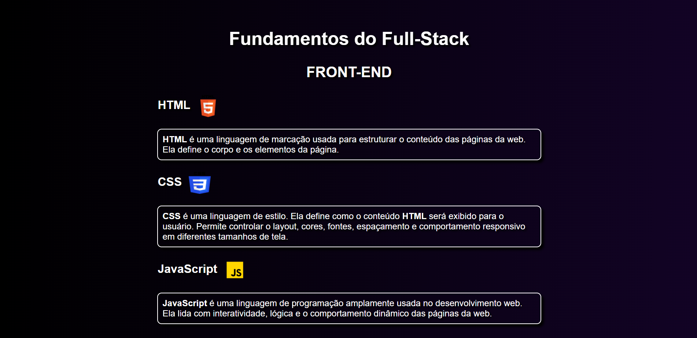

# Fundamentos do Full-stack

Uma página web básica, simples e responsiva que apresenta as principais tecnologias usadas em Full-Stack, incluindo Front-End, Back-End, Bancos de Dados, Git e Github.

## Preview

## Funcionalidades

- Estruturada com HTML5.
- Estilizada com CSS3 usando gradientes, sombras e layout responsivo.
- Inclui logotipos para melhor identificação visual.
- Organizada por seções.
- Link direto para a documentação de cada subtópico ao clicar na imagem correspondente.

## Resumo

### Front-End

- HTML
- CSS
- JavaScript

### Back-End

- Python
- Node.js
- Java
- C#

### Bancos de Dados

- SQLite
- MySQL
- PostgreSQL
- MongoDB

### Controle de Versão e Plataforma de Hospedagem

- Git
- GitHub

## Acesso

Acesse [fundamentos do full-stack](https://guizcode.github.io/fundamentos-do-full-stack/)